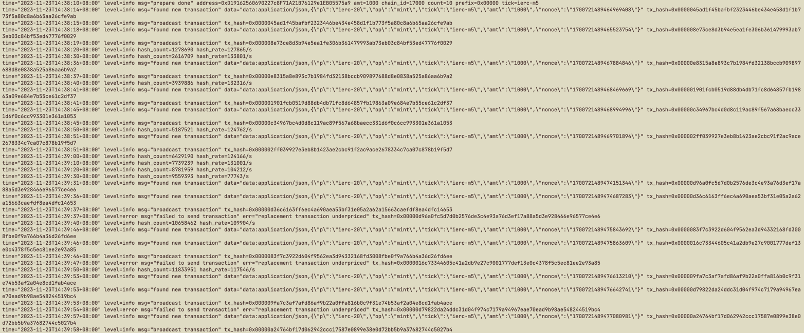

# IERC 多核挖矿程序


[联系作者](https://twitter.com/chenmin22998595)


生成10笔ierc-m5交易耗时2分钟 (8核cpu)



测试地址

https://holesky.etherscan.io/address/0xd19162560690227c8f71a21b76129e1eb05575a9


### 使用方式

1. 在[这里](https://github.com/minchenzz/ierc-miner/releases)下载对应操作系统的版本

2. 在miner程序同目录下创建config.txt文件,根据以下示例修改成你自己的配置

3. 在powershell,cmd或其他命令行中输入 ./ierc_miner.exe 运行 (直接双击不能运行!!!)

```toml
# 你的私钥
private_key = "0x440d58ea9c07ab873295a71f24d41f58776b3732000643178dd351c991b53e48"
# 主网rpc
rpc = "https://1rpc.io/holesky"
# token
tick = "ierc-m5"
# 数量
amt = 1000
# 难度
prefix = "0x00000"
# mint数量
count = 10
# gas优先费用
gas_tip = 5
# 最大gas费用
gas_max = 100
```

注意: 先1张测试成功后再加数量, 或者使用其他gas低的链rpc先测试使用